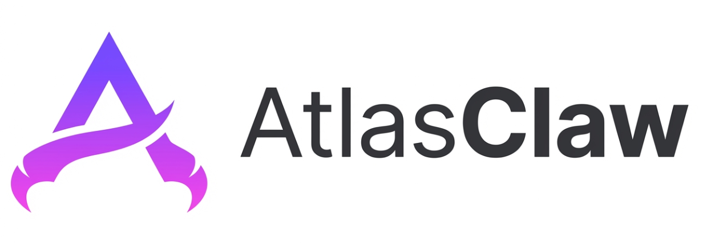

> [!NOTE]
> This repository contains the XuanWu core implementation, including the agent runtime, API layer, channel adapters, provider registry, skills, tools, and session/memory management.

# XuanWu



XuanWu is a centralized intelligent-agent platform for both enterprise and individual users. It fully preserves OpenClaw-compatible core capabilities while extending security and device integration foundations, so teams can build, deploy, and govern intelligent agents from a unified control plane.

## Background

Enterprise and personal AI scenarios are converging: users expect one agent experience across multiple systems, while platform owners need stronger security, governance, and extensibility.

XuanWu is designed around two practical questions:

- How do we provide one centralized intelligent-agent experience across enterprise and personal contexts?
- How do we keep compatibility with OpenClaw capabilities while evolving toward stronger security and broader intelligent-device support?

XuanWu addresses these needs with a platform-oriented agent architecture:

- Unified conversational and execution layer for cross-system workflows
- Skill-first and provider-based extensibility
- Permission inheritance and governance-aware execution
- Multi-channel access through Web UI, APIs, streaming, and webhooks

## Key Capabilities

- LLM-driven Skills model instead of hard-coded fixed workflows
- Skills define scenario boundaries, decision logic, and system interactions
- Centralized agent runtime for analysis, planning, coordination, and execution
- Provider-based integration model for fast expansion of external capabilities
- Thin-core architecture with reusable platform logic and pluggable integrations
- API-first interaction model with REST, WebSocket, SSE, and webhook entry points
- Flexible model backend support via external model providers
- Built-in path for secure sandboxed execution and policy enforcement

### OpenClaw Compatibility (Current)

| Capability | Status | Notes |
|---|---|---|
| Multi-channel access | Supported | REST API, WebSocket, SSE, Webhook |
| Agent streaming runtime | Supported | Streaming output, tool orchestration, timeout/call limits, abort controls |
| Skills system | Supported | Executable Skills, Markdown Skills, Hybrid Skills |
| Skill loading hierarchy | Supported | Workspace / User / Built-in override model |
| Provider integration | Supported | Built-in and external providers, instance config, auto-discovery |
| Session and thread management | Supported | Create, split, reset, delete, persistence |
| Memory capabilities | Supported | Vector search, full-text retrieval, hybrid recall |
| Authentication strategies | Supported | None, API Key, OIDC, OAuth2 SSO |
| Workflow and Hooks | Supported | Step-based workflow orchestration, lifecycle hooks |

### XuanWu Enhanced Focus

- Secure runtime sandbox for controlled tool/script execution
- Built-in multi-device and IoT-oriented skill support
- Centralized management for agents, model config, and runtime policies

## Deployment Modes

XuanWu supports two practical usage modes.

### Embedded Agent Mode

XuanWu can be embedded as an AI module inside an existing system.

- Embedded in product workflows as an in-system AI capability
- Supports both interactive assistance and automated task execution
- Uses Skills to align with host-system scenarios and permissions

### Standalone Agent Platform Mode

XuanWu can run as an independent centralized agent platform.

- Exposes a unified agent entry point across multiple systems
- Coordinates capabilities through Providers and Skills
- Fits organizations that need centralized governance and shared agent intelligence

## Architecture

XuanWu follows a thin-core plus rich-extension architecture.

- Channels provide user/programmatic entry points
- Core hosts API, runtime orchestration, sessions, and memory
- Model services are external and configurable
- Providers encapsulate platform-specific integrations
- Execution remains bounded by authentication and authorization context

### Overall Architecture


At a high level, requests enter through supported channels, pass through XuanWu Core, and execute through Providers and Skills. In embedded mode, XuanWu lives inside existing products. In standalone mode, it acts as a centralized agent platform across multiple systems.

### Core Architecture


Core runtime components in this repository:

- `API Layer`: REST, WebSocket, SSE, webhook endpoints
- `Agent Engine`: routing, prompt building, tool selection, execution orchestration
- `Session & Memory`: context persistence, retrieval, and continuity
- `Tools & Skills`: reusable execution units and domain capabilities
- `Provider Registry`: integration registration and discovery
- `Execution Context`: request-scoped auth/tenant/runtime dependency context

## Repository Layout

```text
project-root/
|-- app/xuanwu/api/         # REST, SSE, WebSocket, gateway orchestration
|-- app/xuanwu/agent/       # Agent runner, routing, streaming, prompt building
|-- app/xuanwu/channels/    # Channel adapters and registries
|-- app/xuanwu/core/        # Config, execution context, provider registry
|-- app/xuanwu/memory/      # Memory manager and retrieval
|-- app/xuanwu/session/     # Session context, queue, and manager
|-- app/xuanwu/skills/      # Skill loading and registry
|-- app/xuanwu/tools/       # Built-in tools and tool catalog
|-- app/xuanwu/workflow/    # Workflow engine and orchestrator
|-- docs/                      # Architecture, modules, guides, plans
`-- tests/                     # Pytest test suite
```

## Further Reading

- [Architecture](docs/ARCHITECTURE.MD)
- [Module Details](docs/MODULE-DETAILS.MD)
- [Development Spec](docs/DEVELOPMENT-SPEC.MD)
- [Provider Guide](docs/PROVIDER-GUIDE.MD)
- [Skill Guide](docs/SKILL-GUIDE.MD)
- [Channel Guide](docs/CHANNEL-GUIDE.MD)
